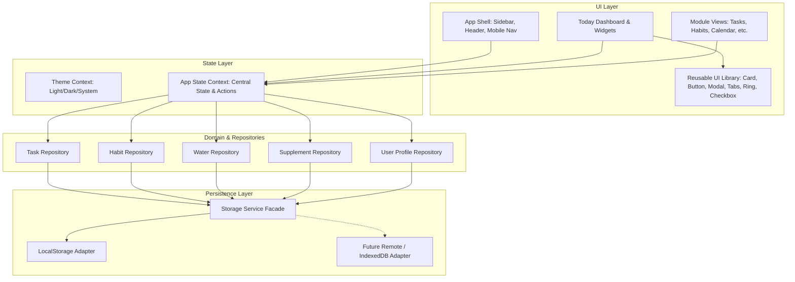

# "Just Do It" — Digital Life Organizer
## Comprehensive Development Plan & System Architecture

### 1. Vision & Product Overview
**"Just Do It"** is a unified personal operating system designed to bring clarity, calm, and proactive execution to daily life. It harmonizes tasks, calendar schedules, habit streaks, hydration, supplement routines, workouts, self-care, academic subjects, career milestones, long-term goals, and hobbies into a single, cohesive experience.

Guided by **Apple's Design Philosophy**, the application emphasizes:
- **Calm Visual Hierarchy**: Essential information front and center without sensory overload.
- **Craft & Materiality**: Subtle hairline borders, translucent glass surfaces (`backdrop-filter`), tactile micro-interactions, and refined typography.
- **Instant Speed**: Zero latency, optimistic updates, and persistent state.
- **Customizability First**: Users can freely define habits, categories, supplement schedules, academic subjects, and career goals rather than being boxed into rigid templates.

---

### 2. Technology Stack & Rationale

| Component | Choice | Rationale |
| :--- | :--- | :--- |
| **Core Framework** | **React 18/19 with TypeScript** | Strict type safety, clean component composition, and widespread community maintainability. |
| **Bundler & Build Tool** | **Vite** | Blazing-fast development server with instant HMR and optimized production bundling. |
| **Design & Styling** | **Vanilla CSS with Custom Properties (Tokens)** | True Apple aesthetics without external CSS framework bloat or arbitrary utility strings. Native support for CSS variables, dark/light modes, and modern glassmorphism. |
| **Iconography** | **Lucide React** | Feather-light, consistent, and geometrically aligned vector icons reminiscent of Apple SF Symbols. |
| **State & Reactivity** | **React Context + Custom Domain Hooks** | Eliminates unnecessary external state libraries while ensuring clear unidirectional data flow and modularity. |
| **Persistence Layer** | **Repository Pattern + Storage Service** | Decouples data access from UI components. Initially persists in `localStorage` with a clean adapter interface (`IStorageAdapter`), enabling frictionless future migration to IndexedDB, SQLite (WASM), or remote backends (Supabase/PostgreSQL). |

---

### 3. System Architecture & Separation of Concerns



---

### 4. Folder Structure

```
just-do-it/
├── DEVELOPMENT_PLAN.md          # Architecture & blueprint
├── index.html                   # HTML entry point with Apple typography & meta
├── package.json
├── tsconfig.json
├── vite.config.ts
├── src/
│   ├── main.tsx                 # App bootstrapping
│   ├── App.tsx                  # Root app component with providers
│   ├── types/                   # Domain TypeScript models
│   │   └── index.ts
│   ├── styles/                  # Design tokens and modular CSS
│   │   ├── tokens.css           # Apple colors, typography, shadows, transitions
│   │   ├── base.css             # Resets, normalization, scrollbars
│   │   ├── layout.css           # Shell, sidebar, header, mobile navigation
│   │   ├── components.css       # Reusable UI component styling
│   │   └── today.css            # Today dashboard specific styling
│   ├── services/
│   │   └── storage/             # Persistence abstraction
│   │       ├── IStorageAdapter.ts
│   │       ├── LocalStorageAdapter.ts
│   │       ├── StorageService.ts
│   │       └── repositories/
│   │           ├── TaskRepository.ts
│   │           ├── HabitRepository.ts
│   │           ├── WaterRepository.ts
│   │           ├── SupplementRepository.ts
│   │           └── ProfileRepository.ts
│   ├── data/
│   │   └── seedData.ts          # Realistic starter dataset for day-one delight
│   ├── context/
│   │   ├── AppContext.tsx       # Global application state & mutations
│   │   └── ThemeContext.tsx     # Light/Dark mode state & system listener
│   ├── components/
│   │   ├── ui/                  # Pure reusable UI components
│   │   │   ├── Card.tsx
│   │   │   ├── Button.tsx
│   │   │   ├── Checkbox.tsx
│   │   │   ├── ProgressRing.tsx
│   │   │   ├── ProgressBar.tsx
│   │   │   ├── Badge.tsx
│   │   │   ├── Modal.tsx
│   │   │   ├── Tabs.tsx
│   │   │   ├── Input.tsx
│   │   │   ├── Select.tsx
│   │   │   └── Textarea.tsx
│   │   └── layout/              # Shell framing
│   │       ├── AppShell.tsx
│   │       ├── Sidebar.tsx
│   │       ├── Header.tsx
│   │       └── MobileNav.tsx
│   └── modules/                 # Feature-based domains
│       ├── today/
│       │   ├── TodayDashboard.tsx
│       │   ├── QuickAddModal.tsx
│       │   ├── TodayTasks.tsx
│       │   ├── HabitTrackerWidget.tsx
│       │   ├── WaterWidget.tsx
│       │   ├── SupplementsWidget.tsx
│       │   └── ScheduleTimeline.tsx
│       └── common/
│           └── ModulePlaceholder.tsx # Graceful phase 2 preview for all 13 modules
```

---

### 5. Data Model Strategy

All models are strongly typed and fully extensible:
- **`Task`**: Unique ID, title, description, priority (`low`, `medium`, `high`, `urgent`), dueDate, time, completed flag, category (`work`, `academic`, `personal`, `health`, `finance`), subtasks, and custom tags.
- **`Habit`**: Title, icon/emoji, target frequency (daily/weekly), current streak, highest streak, completion map keyed by ISO date string (`YYYY-MM-DD`), reminder time, and category.
- **`WaterLog`**: Date key, daily target in milliliters (default 2,500ml), current intake, and individual log entries (`id`, `amountMl`, `timestamp`).
- **`Supplement`**: Name, dosage, timing schedule (`morning`, `noon`, `evening`, `bedtime`), notes, and daily completion status map.
- **`ScheduleItem`**: Title, start time, end time, location/link, category, and completion flag for today's time blocks.
- **`UserProfile`**: Display name, daily focus intention, avatar/initials, and streak score.

---

### 6. Apple-Inspired Design System

- **Color Harmony**:
  - Light mode: Pure system white (`#ffffff`), secondary off-white (`#f5f5f7`), hairline gray borders (`rgba(0, 0, 0, 0.08)`).
  - Dark mode: OLED rich black (`#000000`), elevated dark zinc (`#1c1c1e`), translucent surfaces (`rgba(28, 28, 30, 0.75)`).
  - Accents: Apple System Blue (`#0071e3` / `#0a84ff`), Mint Green (`#30d158`), Amber Orange (`#ff9f0a`), Coral Red (`#ff453a`), Violet (`#5e5ce6`).
- **Visual Materials**:
  - Frosted glass headers and navigation via `backdrop-filter: blur(20px) saturate(180%)`.
  - Crisp 1px hairline dividers and borders.
  - Generous padding and calm breathing room.
  - Micro-spring transitions (`cubic-bezier(0.16, 1, 0.3, 1)`).

---

### 7. Implementation Roadmap & Phases

- **Phase 1 (Current Focus)**:
  - Project foundation & Vite TypeScript setup.
  - Design system with CSS tokens and themes.
  - Storage service and initial seed data.
  - Core UI component library.
  - Application shell (Sidebar, Header, Mobile Nav, Routing).
  - Complete, interactive **Today Dashboard** with live task toggles, habit checks, hydration logs, supplement checks, and Quick Add modal.
  - Module placeholders for remaining 13 sections so navigation is 100% active.
- **Phase 2**: Full Task Manager (Kanban, subtasks, tag filtering) and Habit Builder (analytics, calendar heatmaps).
- **Phase 3**: Health Suite (detailed workouts, custom routines, water history, supplement scheduler).
- **Phase 4**: Growth Suite (Goals OKRs, Academics GPA & course organizer, Career milestones, Hobbies portfolio).
- **Phase 5**: Analytics & Settings (productivity charts, data export/import, backup, offline sync).

---

### 8. Scalability & Extensibility Considerations

1. **Storage Decoupling**: Repositories interact only with the `StorageService` interface. Migrating from `localStorage` to IndexedDB or a remote cloud database (e.g. Supabase, Firebase, Node/PostgreSQL) requires modifying only the adapter implementation without altering any React components.
2. **Schema Migration**: Storage keys include version identifiers (`jid_v1_...`), allowing smooth schema migrations as data structures evolve.
3. **Performance**: Zero bulky dependencies, pure CSS animations, and lazy rendering keep the bundle size under 150KB gzipped with instant 60 FPS interactions.
